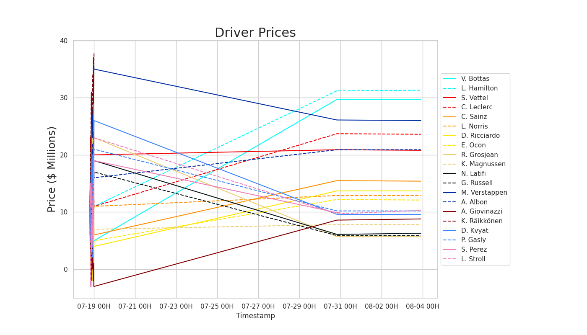

| Driver | Price | Driver | Price |
| ---- | ---- | ---- | ---- |
| L. Hamilton | $11M | V. Bottas | $5M |
| M. Verstappen | $35M | C. Leclerc | $11M |
| S. Vettel | $20M | A. Albon | $16M |
| C. Sainz | $6M | D. Ricciardo | $4M |
| L. Norris | $11M | E. Ocon | $5M |
| P. Gasly | $21M | S. Perez | $19M |
| K. Raikkonen | $38M | D. Kvyat | $26M |
| L. Stroll | $23M | A. Giovinazzi | $-3M |
| K. Magnussen | $7M | G. Russell | $17M |
| N. Latifi | $19M | R. Grosjean | $23M |

| Team | Price | Team | Price |
|----|----|----|----|
| Mercedes | $23M | Alfa Romeo | $19M |
| Ferrari | $7M | Williams | $16M |
| Red Bull | $-3M | AlphaTauri | $17M |
| Renault | $17M | Racing Point | $24M |
| Haas | $4M | McLaren | $-1M |

Last updated at 2020-07-19 00:41:36.494930

